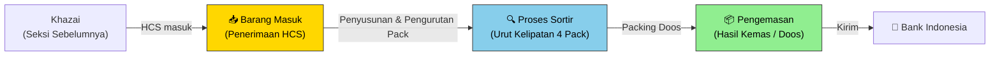
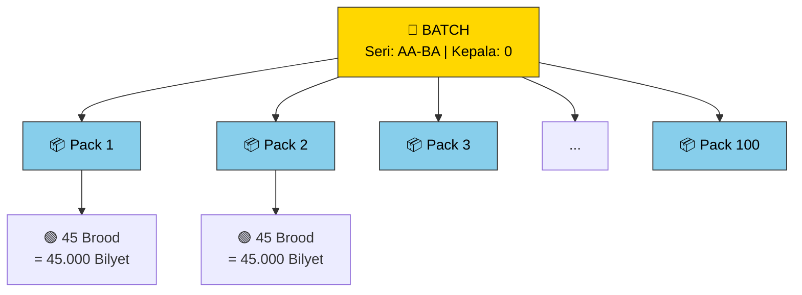
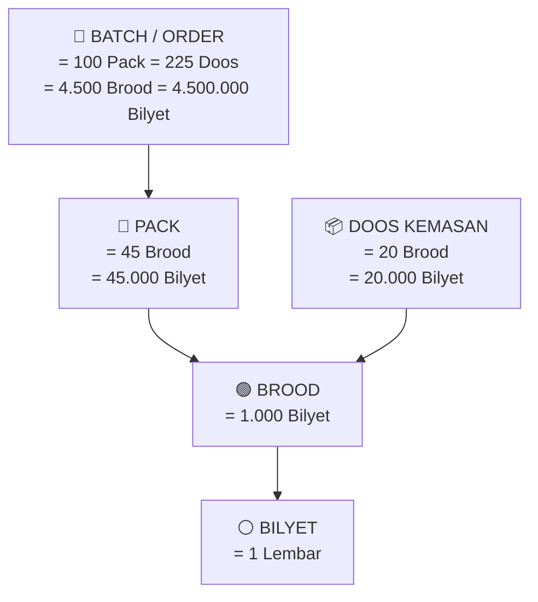

# Aplikasi Monitoring Produksi Uang Kertas — Seksi Khazprokhir

Aplikasi web untuk memonitor alur produksi uang kertas mulai dari barang masuk (HCS) hingga hasil kemas yang siap dikirim ke Bank Indonesia. **Menggantikan proses pelaporan manual (tulis tangan + banyak file Excel)** menjadi satu sistem terpusat.

## Alur Bisnis (Business Flow)



---

## Identitas Batch (Seri, Kepala, Pack)

Setiap batch memiliki identitas unik berdasarkan **seri** dan **kepala**, serta berisi **100 pack** bernomor 1–100.



| Field | Contoh | Keterangan |
|-------|--------|------------|
| **Seri** | `AA-BA` | Kode seri uang kertas |
| **Kepala** | `0` | Digit kepala / prefix nomor seri |
| **Pack** | `1` s/d `100` | Nomor urut pack dalam batch |

> [!NOTE]
> Identitas lengkap sebuah pack bisa dibaca sebagai: **Seri AA-BA, Kepala 0, Pack 27**. Ini memudahkan operator untuk mengidentifikasi pack mana yang sedang diproses di setiap tahap.

---

## Hierarki Satuan Uang Kertas



| Satuan | Jumlah Bilyet | Jumlah Brood | Keterangan & Hubungan |
|--------|--------------|--------------|-----------------------|
| **1 Bilyet** | 1 lembar | - | Satuan terkecil fisik uang |
| **1 Brood** | 1.000 bilyet | 1 brood | Satuan ikat/tumpukan sortir |
| **1 Doos** | 20.000 bilyet | 20 brood | Satuan fisik kardus/dus pengemasan |
| **1 Pack** | 45.000 bilyet | 45 brood | Satuan kelompok sortir & kemas |
| **4 Pack** | **180.000 bilyet** | **180 brood** | **= Tepat 9 Doos Kemasan** (180.000 / 20.000) |
| **1 Batch (Order)** | 4.500.000 bilyet | 4.500 brood | 100 pack = **225 Doos Kemasan** |

> [!IMPORTANT]
> **Mengapa wajib kelipatan 4 pack?**
> Setiap 1 pack berisi 45.000 bilyet, sedangkan 1 doos kemasan berisi 20.000 bilyet. 
> Kelipatan persekutuan terkecil yang menghasilkan doos bulat tanpa sisa bilyet adalah **4 pack = 180.000 bilyet = 9 doos kemasan**.
> 
> **Satuan kunci per tahap:**
> - **Barang Masuk**: diterima per **batch** (100 pack) — diidentifikasi dengan **seri + kepala**
> - **Sortir**: menyusun dan mengurutkan pack yang acak menjadi kelompok **kelipatan 4 pack**
> - **Kemas**: pengemasan fisik ke dalam **doos** (setiap 4 pack = 9 doos)
> - **Pengiriman**: dikirim ke Bank Indonesia dalam satuan pack / doos kemasan

---

## User Roles & Akses

| Role | Akses | Deskripsi |
|------|-------|-----------|
| **Operator** | Input data barang masuk, sortir, kemas | Petugas lapangan di setiap stasiun |
| **Supervisor / Kepala Seksi** | Monitoring dashboard + semua data | Mengawasi progress harian |
| **Manajemen** | Dashboard executive + laporan | Melihat performa keseluruhan |
| **Auditor** | Read-only semua data + audit trail | Verifikasi & compliance |

> [!NOTE]
> **Approval flow** belum diaktifkan saat ini, tapi database dan API sudah disiapkan agar bisa ditambahkan di kemudian hari tanpa perubahan besar.

---

## Tech Stack

| Layer | Teknologi | Alasan |
|-------|-----------|--------|
| **Frontend** | React + Vite + TailwindCSS | Cepat, modern, component-based |
| **UI Library** | shadcn/ui | Komponen siap pakai, clean design |
| **Charting** | Recharts | Library chart ringan untuk dashboard |
| **Backend** | Node.js + Express | Lightweight, JSON-native |
| **ORM** | Prisma | Type-safe, migrasi database otomatis |
| **Database** | PostgreSQL | Relational, cocok untuk data transaksi produksi |
| **Authentication** | JWT + bcrypt | Session management aman |
| **Export** | ExcelJS + PDFKit | Export laporan ke Excel dan PDF |

---

## Database Schema (ERD)

```mermaid
erDiagram
    users {
        int id PK
        string username UK
        string password_hash
        string full_name
        enum role "operator|supervisor|management|auditor"
        boolean is_active
        timestamp created_at
        timestamp updated_at
    }

    denominasi {
        int id PK
        string nama "Rp100.000 / Rp50.000 / dll"
        int nilai
        boolean is_active
    }

    emisi {
        int id PK
        string kode_emisi "TE 2024 / dll"
        string sandi "Sandi emisi (contoh: Y'22)"
        string tahun
        int denominasi_id FK
        boolean is_active
    }

    shift {
        int id PK
        string nama "Shift 1 / Shift 2 / Shift 3"
        string jam_mulai "06:00"
        string jam_selesai "14:00"
        boolean is_active
    }

    target_tahunan {
        int id PK
        int tahun_anggaran "Contoh: 2024, 2025, 2026"
        int denominasi_id FK
        bigint target_bilyet "target bilyet setahun"
        bigint target_brood "auto: target_bilyet / 1000"
        int target_pack "auto: target_brood / 45"
        text catatan
        timestamp created_at
        timestamp updated_at
    }

    target_bulanan {
        int id PK
        int tahun_anggaran "Contoh: 2026"
        int bulan "1 s/d 12"
        int denominasi_id FK
        bigint target_penyerahan_bilyet "Target kirim BI bulanan"
        bigint target_pengemasan_bilyet "Target kemas bulanan"
        int sisa_hari_kerja "Jumlah sisa hari kerja bulan ini (misal: 12)"
        timestamp created_at
        timestamp updated_at
    }

    batch {
        int id PK
        string nomor_batch "Nomor batch/order"
        int tahun_anggaran "Contoh: 2024, 2025"
        string seri "Contoh: AA-BA"
        string kepala "Contoh: 0"
        int emisi_id FK
        int jumlah_pack "default 100"
        enum status "pending|in_progress|completed"
        timestamp created_at
        timestamp updated_at
        _unique nomor_batch_tahun "UK: nomor_batch + tahun_anggaran"
    }

    bon_masuk {
        int id PK
        string no_segel UK "Nomor segel dari bon Khazai"
        int batch_id FK
        date tanggal_masuk
        time jam_masuk
        int pack_dari "Contoh: 1"
        int pack_sampai "Contoh: 50"
        int jumlah_bilyet "total bilyet dalam bon ini"
        string jenis_mesin_sortir "metadata dari seksi sebelumnya (BPS M7, dll)"
        enum kategori_penerimaan "masinal|parsial (default: masinal)"
        int shift_id FK
        int operator_id FK
        text catatan
        timestamp created_at
    }

    pack_detail {
        int id PK
        int batch_id FK
        int bon_masuk_id FK "bon mana yang membawa pack ini"
        int nomor_pack "1 s/d 100"
        int jumlah_brood "default 45"
        bigint jumlah_bilyet "default 45000"
        int hasil_kemas_id FK "nullable - terisi saat pack dikemas"
        string no_doos_range "nullable - contoh: Doos 1-9"
        enum status "pending|received|sorted|packed|shipped"
        timestamp created_at
        timestamp updated_at
    }

    proses_sortir {
        int id PK
        int batch_id FK "referensi batch"
        int pack_dari "Pack awal yang diurutkan"
        int pack_sampai "Pack akhir yang diurutkan"
        int total_pack "Kelipatan 4: 4, 8, 12, dst."
        int shift_id FK
        int operator_id FK "penyortir/penanggung jawab"
        date tanggal_sortir
        int total_brood "total_pack x 45 brood (tidak ada reject)"
        bigint total_bilyet "total_brood x 1000 bilyet"
        enum status "in_progress|completed"
        text catatan "Catatan proses sortir/urutan"
        timestamp started_at
        timestamp completed_at
    }

    sortir_pack_detail {
        int id PK
        int proses_sortir_id FK
        int pack_detail_id FK
    }

    hasil_kemas {
        int id PK
        int batch_id FK "referensi ke batch asal"
        int proses_sortir_id FK "referensi sesi sortir yang dikemas"
        int denominasi_id FK "scoping nomor doos per pecahan"
        int tahun_anggaran "scoping nomor doos per tahun"
        int pack_dari "Pack awal yang dikemas (misal: 1)"
        int pack_sampai "Pack akhir yang dikemas (misal: 4)"
        int total_pack "Kelipatan 4 (misal: 4)"
        int no_doos_awal "Nomor doos awal (misal: 1)"
        int no_doos_akhir "Nomor doos akhir (misal: 9)"
        int total_doos "auto: (total_pack / 4) * 9"
        bigint total_bilyet "auto: total_pack x 45000 bilyet"
        string no_ba_pengemasan "Nomor BA Pengemasan harian (iterasi berurutan per tanggal, misal: 157, 158, 159)"
        int shift_id FK
        int operator_id FK "petugas pengemasan"
        date tanggal_kemas
        enum status "ready|shipped"
        timestamp created_at
    }

    kemas_pack_detail {
        int id PK
        int hasil_kemas_id FK
        int pack_detail_id FK
    }

    pengiriman {
        int id PK
        string nomor_surat_jalan UK "Nomor laporan/surat jalan"
        date tanggal_kirim "Tanggal kirim ke BI"
        int tahun_anggaran "Contoh: 2026"
        int denominasi_id FK "Pecahan yang dikirim"
        string sandi_emisi "Sandi emisi (contoh: Y'22)"
        int no_doos_awal "Doos awal yang dikirim (contoh: 45251)"
        int no_doos_akhir "Doos akhir yang dikirim (contoh: 47250)"
        int total_doos "Total doos dikirim (contoh: 2000)"
        bigint total_bilyet "total_doos x 20.000 bilyet (contoh: 40.000.000)"
        decimal total_nominal "total_bilyet x nilai rupiah"
        string no_ba_penyerahan "Baru diterbitkan saat akan dikirim ke BI (contoh: 27/B/Y/TE'2022/43/2026)"
        string no_ba_pengemasan_rekap "Rekap no BA pengemasan (contoh: 157-159)"
        string keterangan "default: UTAS"
        string tujuan "default: Bank Indonesia"
        string lokasi_penyerahan "default: Karawang"
        string penyerah_nama "Nama Kepala Seksi"
        string penyerah_jabatan "Kepala Seksi"
        string penerima_nama "nullable"
        int created_by FK
        int approved_by FK "nullable - untuk future approval"
        enum status "draft|approved|shipped"
        text catatan
        timestamp created_at
        timestamp shipped_at
    }

    pengiriman_detail {
        int id PK
        int pengiriman_id FK
        int hasil_kemas_id FK
        int batch_id FK
        int no_doos_awal "Doos awal baris ini"
        int no_doos_akhir "Doos akhir baris ini"
        int jumlah_kemasan_doos "Jumlah doos baris ini"
        string no_ba_penyerahan "nullable"
        string keterangan "UTAS"
        date tanggal_pengemasan
        string no_ba_pengemasan "Nomor BA Pengemasan (misal: 157)"
    }

    audit_log {
        int id PK
        int user_id FK
        string action "CREATE|UPDATE|DELETE"
        string module "bon_masuk|sortir|kemas|pengiriman"
        string table_name
        int record_id
        json old_value "nullable"
        json new_value
        string ip_address
        timestamp created_at
    }

    transaksi_hcts {
        int id PK
        date tanggal "Tanggal transaksi HCTS"
        int denominasi_id FK
        bigint penerimaan_bilyet "Penerimaan HCTS (bilyet)"
        bigint penyerahan_bilyet "Penyerahan HCTS hari ini (bilyet)"
        bigint akumulasi_penyerahan_bi "Akm penyerahan ke BI (bilyet)"
        bigint persediaan_hcts "Stok persediaan HCTS (bilyet)"
        int jumlah_ct_siap_hitung "Jumlah CT Siap Hitung"
        text catatan
        timestamp created_at
    }

    rencana_penyerahan {
        int id PK
        date tanggal_rencana "Tanggal rencana penyerahan (misal: 14 September 2026)"
        int denominasi_id FK
        bigint kurang_pengemasan_bilyet "Kekurangan pengemasan (bilyet)"
        int kurang_pengemasan_doos "Kekurangan pengemasan (doos)"
        bigint kurang_penerimaan_bilyet "Kekurangan penerimaan (bilyet)"
        int kurang_penerimaan_vell "Kekurangan penerimaan (vell)"
        text catatan
        timestamp created_at
    }

    users ||--o{ bon_masuk : "input"
    users ||--o{ proses_sortir : "operates"
    users ||--o{ hasil_kemas : "packs"
    users ||--o{ pengiriman : "creates"
    users ||--o{ audit_log : "performs"
    denominasi ||--o{ emisi : "has"
    denominasi ||--o{ target_tahunan : "yearly target"
    emisi ||--o{ batch : "belongs"
    batch ||--o{ bon_masuk : "received via"
    batch ||--o{ pack_detail : "contains 100 packs"
    bon_masuk ||--o{ pack_detail : "delivers"
    shift ||--o{ bon_masuk : "during"
    shift ||--o{ proses_sortir : "during"
    shift ||--o{ hasil_kemas : "during"
    proses_sortir ||--o{ sortir_pack_detail : "includes"
    pack_detail ||--o{ sortir_pack_detail : "processed in"
    proses_sortir ||--o{ hasil_kemas : "packaged from"
    hasil_kemas ||--o{ kemas_pack_detail : "packages"
    pack_detail ||--o{ kemas_pack_detail : "included in"
    batch ||--o{ proses_sortir : "sorted from"
    batch ||--o{ hasil_kemas : "originates"
    pengiriman ||--o{ pengiriman_detail : "contains"
    hasil_kemas ||--o{ pengiriman_detail : "shipped in"
```



> [!TIP]
> **Perubahan kunci:**
> - **`batch`** dan **`bon_masuk`** dipisah — satu batch bisa diterima dalam beberapa bon (pengiriman parsial dari Khazai)
> - **`mesin_sortir` dihapus** — Khazprokhir tidak punya mesin sortir, info `jenis_mesin_sortir` hanya metadata dari bon Khazai
> - **`no_segel`** menjadi identifier unik per bon masuk
> - **`pack_detail`** punya status `received` (sudah diterima via bon) selain status proses lainnya

---

## Fitur Utama

### 1. 📥 Modul Barang Masuk (Input Bon dari Khazai)

Operator/penyortir menerima **bon fisik** dari Khazai lalu menginput ke aplikasi.

**Form Input Bon Masuk:**

| Field | Contoh | Keterangan |
|-------|--------|------------|
| **Tahun Anggaran** | `2024` | Tahun anggaran berjalan (default dari tanggal masuk) |
| **No Segel** | `SGL-20240915-001` | Nomor segel di bon (unik) |
| **Tanggal Masuk** | `2024-09-15` | Tanggal penerimaan |
| **Jam Masuk** | `08:30` | Jam penerimaan |
| **Batch** | `ORD-001` | Pilih batch existing atau buat baru di tahun anggaran ini |
| **Seri** | `AA-BA` | Otomatis terisi jika batch sudah ada |
| **Kepala** | `0` | Otomatis terisi jika batch sudah ada |
| **Pack Dari** | `1` | Pack awal dalam bon ini |
| **Pack Sampai** | `50` | Pack akhir dalam bon ini |
| **Jumlah Bilyet** | `2.250.000` | Auto-calculate dari jumlah pack × 45 × 1000 |
| **Jenis Mesin Sortir** | `BPS M7` | Info dari bon — mesin sortir di seksi sebelumnya |
| **Shift** | `Shift 1` | Shift saat penerimaan |

**Perilaku sistem & Validasi:**
- **Validasi 1 Batch per Tahun Anggaran**: Nomor batch bersifat unik per tahun anggaran (kombinasi `nomor_batch` + `tahun_anggaran` unik). Nomor batch yang sama tidak boleh dibuat ulang sebagai entitas baru di tahun anggaran yang sama.
- Jika batch belum ada di tahun anggaran tersebut → sistem membuat batch baru dan meminta input metadata (seri, kepala, denominasi, emisi).
- Jika batch sudah ada di tahun anggaran tersebut → seri, kepala, denominasi, dan emisi otomatis terkunci/terisi dari data batch yang sudah terdaftar.
- **Auto-generate `pack_detail`** untuk pack dalam range (contoh: pack 1–50 → 50 record) dengan status `received`.
- Satu batch bisa diterima dalam **beberapa bon** (contoh: bon 1 membawa pack 1–50, bon 2 membawa pack 51–100).
- **Validasi Range Pack**: Tidak boleh ada nomor pack yang di-input dobel (overlap range) dalam 1 batch, dan nomor pack wajib dalam rentang 1–100.

**List/Tabel Bon Masuk:**
- Filter & search by: tahun anggaran, no segel, seri, kepala, denominasi, tanggal
- Ringkasan: total bon masuk hari ini, total bilyet diterima

### 2. 🔍 Modul Proses Sortir (Pengurutan & Penyusunan Pack)

> [!IMPORTANT]
> **TIDAK ADA BARANG REJECT DI KHAZPROKHIR**:
> Seluruh barang masuk dari Khazai adalah HCS (Hasil Cetak Sempurna).
> Proses "penyortiran" di Khazprokhir bertindak sebagai **pengurutan (sequencing) dan penataan pack yang datang secara acak dari Khazai agar tersusun rapi dengan kelipatan 4**.
> Data urutan pack ini nantinya langsung digunakan untuk **pengemasan ke dalam doos** pada Modul Pengemasan.

**Alur Kerja Penyortiran / Pengurutan Pack:**
1. **Pilih Batch**: Penyortir memilih batch aktif (berdasarkan nomor batch, seri, kepala, denominasi, tahun anggaran).
2. **Pilih Pack yang Tersedia (`status: received`)**:
   - Sistem menampilkan daftar pack yang sudah diterima dari bon Khazai tetapi masih acak/belum diurutkan.
   - Penyortir memilih rentang atau daftar pack yang akan disusun (contoh: pack 1–4, pack 13–20, pack 29–40).
3. **Validasi Wajib Kelipatan 4**:
   - Jumlah pack yang dipilih dalam satu sesi penataan **wajib berkelipatan 4** (misal: 4, 8, 12, 16, 20 pack, dst).
   - Validasi sistem: `total_pack % 4 === 0`. Jika bukan kelipatan 4, sistem menolak penyimpanan.
   - Seluruh nomor pack yang dipilih harus berurutan dan berstatus `received`.
4. **Input Hasil Penyusunan / Urut**:
   - **Total Brood**: Otomatis terhitung (`total_pack × 45 brood`) — 100% utuh tanpa reject.
   - **Total Bilyet**: Otomatis terhitung (`total_brood × 1.000 bilyet`).
   - **Shift & Tanggal**: Shift kerja dan tanggal pelaksanaan sortir/urut.
   - **Penyortir / Penanggung Jawab**: Nama penyortir yang bertanggung jawab menyusun pack tersebut.
   - **Catatan Informasi**: Catatan urutan pack bila ada.
5. **Pembaruan Status Pack**:
   - Begitu penyortir selesai menyortir/menyusun pack dan menyimpan sesi sortir, status pack **langsung berubah dari `received` ke `sorted`** (tanpa status perantara), menandakan pack telah tersusun rapi kelipatan 4 dan siap diproses ke modul pengemasan.
6. ✏️ **Fitur Koreksi / Edit Sesi Sortir (Penanganan Salah Input)**:
   - **Skenario Masalah**: Penyortir salah memilih nomor pack (contoh: tidak sengaja menginput pack 1–4 dari batch tertentu, padahal fisik yang disusun adalah pack 5–8) atau salah memilih shift/operator.
   - **Mekanisme Otomatis**:
     1. Operator membuka data sesi sortir yang keliru pada tabel riwayat sortir, lalu mengedit rentang pack ke yang benar (misal: pack 5–8).
     2. **Rollback Pack Lama**: Pack lama yang salah (pack 1–4) **otomatis dikembalikan statusnya dari `sorted` menjadi `received`**, sehingga kembali tersedia di antrean barang masuk yang belum disusun.
     3. **Assign Pack Baru**: Pack baru (pack 5–8) statusnya **berubah dari `received` menjadi `sorted`**.
     4. Data record sesi sortir diperbarui secara otomatis.
   - **Keamanan & Validasi (Safety Locking)**:
     - 🔒 **Proteksi Status**: Sesi sortir **hanya boleh diedit jika pack di dalamnya BELUM DIKEMAS (statusnya masih `sorted`, belum `packed` atau `shipped`)**.
     - Jika pack sudah dikemas ke dalam doos (`packed`), sistem akan mengunci sesi sortir tersebut:
       *⚠️ "Sesi sortir terkunci: Pack telah masuk ke dalam doos pengemasan. Batalkan/edit pengemasan terlebih dahulu jika ingin mengubah sortir."*
     - Pack pengganti wajib sama jumlahnya (tetap kelipatan 4 pack) dan saat ini berstatus `received`.
     - Setiap pengeditan mewajibkan input alasan perubahan dan **tercatat lengkap di `audit_log`**.
- Progress bar per batch: berapa pack dari 100 yang sudah tersusun rapi (`sorted`)
- Summary produktivitas pengurutan pack per penyortir dan per shift (tanpa reject rate)

### 3. 📦 Modul Pengemasan (Hasil Kemas & Penomoran Doos)

Petugas pengemasan memantau hasil inputan penyortir yang sudah tersusun urut (`sorted`), kemudian mencatatkan nomor doos hasil pengemasan ke dalam aplikasi.

**Alur Kerja Input Pengemasan:**
1. **Pilih Antrean Sortir (`status: sorted`)**:
   - Petugas pengemasan melihat daftar pack yang telah siap dikemas (tersusun dalam kelipatan 4 pack, contoh: Batch `1822001`, Pack `1–4`).
2. **Input Penomoran Doos & No. BA Pengemasan**:
   - **No Doos Awal**: Nomor doos pertama (contoh: `1`).
   - **No Doos Akhir**: Nomor doos terakhir (contoh: `9`).
   - **No. BA Pengemasan**: Nomor Berita Acara Pengemasan harian yang **beriterasi urut setiap tanggal kemas** (contoh: tgl 31 Agustus nomor `157`, tgl 01 September nomor `158`, tgl 02 September nomor `159`). Sistem meng-auto-increment nomor iterasi berdasarkan tanggal kemas terakhir atau petugas dapat menyesuaikannya.
   - **Shift & Tanggal Kemas**: Shift kerja dan tanggal pelaksanaan pengemasan.
   - **Petugas Pengemas**: Operator yang melakukan pengemasan fisik.
3. **Aturan Perhitungan & Validasi Doos (Independen per Denominasi)**:
   - **Kalkulasi Bilyet**: `total_bilyet = total_pack × 45.000 bilyet` (misal 4 pack = 180.000 bilyet).
   - **Kalkulasi Doos**: Karena 1 doos = 20.000 bilyet, maka `total_doos = (total_pack / 4) × 9 doos` (misal 4 pack = tepat 9 doos).
   - **Penomoran Doos per Denominasi**: **Setiap denominasi memiliki penomoran nomor doos tersendiri** (terpisah/independen). Contoh: Doos 1–9 pada pecahan Rp100.000 tidak bertabrakan dengan Doos 1–9 pada pecahan Rp50.000.
   - **Validasi Sistem**: Rentang `(no_doos_akhir - no_doos_awal + 1)` **wajib sama persis** dengan `total_doos`. Sistem menolak jika jumlah doos tidak sesuai kalkulasi.
   - **Validasi Unik Doos**: Rentang nomor doos tidak boleh overlap untuk **denominasi yang sama dalam tahun anggaran yang sama**.
4. **Pembaruan Status Pack**:
   - Begitu data disimpan, seluruh pack yang dikemas (contoh: Pack 1–4) statusnya **langsung berubah dari `sorted` menjadi `packed`** dengan catatan nomor doos (contoh: Doos 1–9).
   - Hasil kemas ini berstatus **`ready`** (siap masuk ke modul pengiriman).
5. ✏️ **Fitur Koreksi / Edit Kemasan (Penanganan Salah Input)**:
   - **Skenario Masalah**: Operator salah memasukkan nomor pack pada rentang doos tertentu (contoh: pack 5–8 dari batch `1822002` tidak sengaja dimasukkan ke Doos 10–18, padahal seharusnya yang dikemas adalah pack 13–16).
   - **Mekanisme Otomatis**:
     1. Operator memilih data kemasan yang ingin dikoreksi pada tabel hasil kemas, lalu memasukkan rentang pack pengganti yang benar (pack 13–16).
     2. **Rollback Otomatis Pack Lama**: Pack lama yang salah (pack 5–8) **otomatis dikembalikan statusnya dari `packed` menjadi `sorted`**, dan asosiasi nomor doos-nya dilepas sehingga pack tersebut kembali tersedia di antrean sortir.
     3. **Assign Otomatis Pack Baru**: Pack baru (pack 13–16) statusnya **berubah dari `sorted` menjadi `packed`** dan otomatis terhubung ke Doos 10–18.
     4. Data `hasil_kemas` diperbarui rentang pack-nya.
   - **Keamanan & Validasi**:
     - Edit kemasan **hanya diizinkan jika status kemasan masih `ready`** di gudang (belum diterbitkan surat jalan / belum `shipped`).
     - Jumlah pack pengganti harus sama persis (misal sama-sama 4 pack) agar kalkulasi doos tetap sinkron.
     - Setiap pengeditan mewajibkan input catatan/alasan perubahan dan **tercatat lengkap di `audit_log`** (user, waktu, old value, new value).
### 4. 📦 Modul Monitoring Doos per Denominasi (Buku Register Doos)

> [!IMPORTANT]
> **Fitur Khusus Monitoring Doos**: Karena setiap pecahan memiliki penomoran nomor doos tersendiri dan fisik doos disimpan di gudang hasil kemas sebelum dikirim ke BI, modul ini berfungsi sebagai **buku kontrol / register doos real-time per pecahan**.

**Fitur & Tampilan Monitoring Doos:**
1. **Pilihan Denominasi & Tahun Anggaran (Tab Filter)**:
   - Pengguna dapat beralih antar pecahan dengan 1 klik (Rp100.000, Rp50.000, Rp20.000, Rp10.000, Rp5.000, Rp2.000, Rp1.000).
2. **Kartu Metrik Doos per Pecahan**:
   - 🏷️ **Nomor Doos Terakhir Terbit**: Menampilkan nomor doos tertinggi yang sudah dipack saat ini (contoh: Rp100.000 sudah sampai `Doos No. 450`).
   - 📦 **Total Doos Terkemas**: Total doos yang sudah dipacking tahun berjalan.
   - 🏢 **Stok Doos di Gudang (Ready to Ship)**: Jumlah doos fisik yang siap di gudang menunggu pengiriman.
   - 🚚 **Doos Terkirim ke BI (Shipped)**: Jumlah doos yang sudah dikirim dengan surat jalan.
   - 🎯 **Pencapaian Target Doos**: Realisasi vs Target Doos tahunan (`Target Bilyet ÷ 20.000`).
3. **Buku Register Doos (Tabel Transparansi Lengkap)**:
   - Tabel urut nomor doos dari nomor 1 s/d nomor terakhir untuk pecahan terpilih:
     - **Rentang No Doos** (misal `1–9`, `10–18`, `19–27`, dst.)
     - **Nomor Batch & Emisi** (misal `1822001 - TE 2022`)
     - **Seri & Kepala** (misal `AA-BA`, Kepala `0`)
     - **Rentang Pack** (misal Pack `1–4`)
     - **Total Bilyet** (misal 180.000 bilyet)
     - **Tanggal & Shift Pengemasan**
     - **Petugas Pengemas**
     - **Status Doos**: `📦 Ready di Gudang` atau `🚚 Shipped ke BI`
     - **Nomor Surat Jalan** (jika sudah terkirim)
4. **Deteksi Otomatis Gap / Nomor Terlewat (Integritas Doos)**:
   - Sistem secara otomatis memeriksa kesinambungan nomor doos.
   - Jika ada rentang doos yang terlewat (misal ada doos 1–9 lalu langsung doos 19–27, tanpa doos 10–18), sistem akan memunculkan **Warning Banner / Alert**:
     *⚠️ "Peringatan: Pada pecahan Rp100.000, terdapat gap nomor Doos 10–18 yang belum tercatat!"*
5. **Export & Laporan Opname Doos**:
   - Dapat diunduh dalam format Excel (.xlsx) atau dicetak PDF sebagai berita acara fisik stok doos di seksi Khazprokhir.

### 5. 🚚 Modul Pengiriman ke Bank Indonesia

Modul ini digunakan petugas untuk membuat laporan pengiriman resmi Hasil Cetak Sempurna ke Bank Indonesia.

> [!IMPORTANT]
> **Format Dokumen Resmi**: Modul ini menghasilkan dokumen resmi **"LAPORAN PENGIRIMAN HASIL CETAK SEMPURNA KE BANK INDONESIA"** yang identik dengan format fisik Seksi Khazanah Produk Akhir (lengkap dengan kop seksi, tabel terperinci yang urut per nomor kemasan/doos, total doos & bilyet, serta kolom tanda tangan penyerahan).

**Alur Kerja Input Pengiriman:**
1. **Input Data Pengiriman & No. BA Penyerahan**:
   - **Pecahan / Denominasi**: Pilih pecahan (contoh: `Rp 100.000,-`, Sandi: `Y'22`).
   - **Tahun Anggaran**: Tahun anggaran yang berlaku (contoh: `TA. 2026`).
   - **No Doos Dari & Sampai**: Masukkan rentang doos yang dikirim (contoh: `45251 s/d 47250`).
   - **Tanggal Kirim**: Tanggal penyerahan ke BI (contoh: `Senin, 7 September 2026`).
   - **No. Berita Acara Penyerahan**: Nomor Berita Acara Penyerahan yang **baru diterbitkan saat barang akan dikirim ke Bank Indonesia** (contoh: `27/B/Y/TE'2022/43/2026`). Petugas memasukkan nomor ini di form pengiriman.
   - **Pejabat Penyerah**: Nama & Jabatan Kepala Seksi (contoh: `M. Rulli Maulana - Kepala Seksi`).
   - **Penerima**: Pihak Bank Indonesia penerima (bila ada).
2. **Auto-Breakdown Rincian Batch (Wajib Urut No Kemasan)**:
   - Sistem memverifikasi ketersediaan seluruh doos dalam rentang `45251 s/d 47250` (status wajib `ready` di gudang dan **tidak boleh ada gap nomor doos**).
   - Sistem otomatis memecah dan menyusun tabel baris per baris **SECARA URUT BERDASARKAN NOMOR KEMASAN (DOOS)** dan mengaitkan batch asalnya, tanggal pengemasan, serta No. BA Pengemasan harian (yang beriterasi per tanggal, contoh: 31 Agustus -> `157`, 01 September -> `158`, 02 September -> `159`):
     - Baris 1: Sandi `Y'22` | Rp 100.000,- | `2 Doos` | Batch `1822 572` | No. Kemasan `45251 s/d 45252` | `UTAS` | `31 Agustus 2026` | `157`
     - Baris 2: Sandi `Y'22` | Rp 100.000,- | `18 Doos` | Batch `1822 569` | No. Kemasan `45253 s/d 45270` | `UTAS` | `31 Agustus 2026` | `157`
     - Baris 3: Sandi `Y'22` | Rp 100.000,- | `18 Doos` | Batch `1822 572` | No. Kemasan `45271 s/d 45288` | `UTAS` | `31 Agustus 2026` | `157`
     - ... (berurutan hingga baris terakhir)
     - Baris N: Sandi `Y'22` | Rp 100.000,- | `45 Doos` | Batch `1822 578` | No. BA Penyerahan `27/B/Y/TE'2022/43/2026` | No. Kemasan `47206 s/d 47250` | `UTAS` | `02 September 2026` | `159`
3. **Rekapitulasi Otomatis**:
   - **Total Jumlah Kemasan**: Dihitung otomatis (contoh: `Jumlah 2.000 Doos`).
   - **Total Jumlah Bilyet**: `2.000 Doos × 20.000 = 40.000.000 Bilyet`.
   - **Total Nilai Nominal**: `40.000.000 × Rp 100.000 = Rp 4.000.000.000.000,-` (Empat Triliun Rupiah).
   - **Rekap No. BA Pengemasan**: Otomatis menggabungkan rentang BA pengemasan yang terlibat (contoh: `157-159`).
4. **Pembaruan Status & Penguncian**:
   - Saat status ditandai **`shipped`**:
     - Seluruh record doos (`hasil_kemas`) dan pack (`pack_detail`) dalam rentang tersebut statusnya **berubah dari `ready` menjadi `shipped`**.
     - Data terkunci permanen demi integritas audit pengiriman ke Bank Indonesia.
5. **Cetak PDF Laporan Pengiriman Resmi**:
   - Layout PDF multi-halaman presisi dengan format laporan resmi:
     - Kop Surat: **SEKSI KHAZANAH PRODUK AKHIR - LAPORAN PENGIRIMAN HASIL CETAK SEMPURNA KE BANK INDONESIA**
     - Tabel 9 Kolom: `SANDI | PECAHAN | JUMLAH KEMASAN (Doos) | BATCH | NO. BERITA ACARA PENYERAHAN | NO. KEMASAN | KETERANGAN | TANGGAL PENGEMASAN | NO. BERITA ACARA PENGEMASAN`
     - Footer: `Karawang, [Tanggal Kirim]`, kolom tanda tangan `Yang menerima,` dan `Yang menyerahkan,` (Kepala Seksi).

### 6. 📊 Dashboard Real-Time

````carousel
**Kartu Ringkasan Utama**

```
┌──────────────────┬──────────────────┬──────────────────┬──────────────────┐
│  📥 HCS Masuk    │  🔍 Dalam Sortir │  📦 Siap Kirim   │  🚚 Terkirim     │
│   12 Batch       │   540 Brood      │   85 Pack        │   320 Pack       │
│   Hari Ini       │   Hari Ini       │   Hari Ini       │   Bulan Ini      │
├──────────────────┼──────────────────┼──────────────────┼──────────────────┤
│  540.000 Pack    │   24.300 Brood   │  3.825 Brood     │  14.400 Brood    │
│  (bilyet)        │   (bilyet)       │  (bilyet)        │  (bilyet)        │
└──────────────────┴──────────────────┴──────────────────┴──────────────────┘
```
<!-- slide -->
**📅 Progress Tahun Anggaran (2024)**

```
Target vs Realisasi Hasil Kemas per Denominasi

Rp100.000  ████████████████████░░░░░░░░░░  68%
           680.000.000 / 1.000.000.000 bilyet

Rp50.000   ████████████░░░░░░░░░░░░░░░░░░  42%
           336.000.000 / 800.000.000 bilyet

Rp20.000   ██████████████████████████░░░░  87%
           435.000.000 / 500.000.000 bilyet

Rp10.000   ████████████████████████░░░░░░  78%
           390.000.000 / 500.000.000 bilyet

Rp5.000    ██████████████████░░░░░░░░░░░░  58%
           174.000.000 / 300.000.000 bilyet
```
<!-- slide -->
**📦 Monitoring Doos per Denominasi (Live Status)**

```
┌──────────────────────────────────────────────────────────────────────────────┐
│ Pecahan     │ Doos Terakhir │ Total Kemas │ Di Gudang (Ready) │ Terkirim BI  │
├──────────────────────────────────────────────────────────────────────────────┤
│ Rp100.000   │ Doos No. 450  │   450 Doos  │    90 Doos (20%)  │   360 Doos   │
│ Rp50.000    │ Doos No. 270  │   270 Doos  │    54 Doos (20%)  │   216 Doos   │
│ Rp20.000    │ Doos No. 180  │   180 Doos  │    18 Doos (10%)  │   162 Doos   │
│ Rp10.000    │ Doos No. 90   │    90 Doos  │     9 Doos (10%)  │    81 Doos   │
│ Rp5.000     │ Doos No. 36   │    36 Doos  │     0 Doos (0%)   │    36 Doos   │
└──────────────────────────────────────────────────────────────────────────────┘
⚠️ Integritas Doos: Tidak ditemukan nomor doos yang loncat/terlewat (Gap: 0)
```
<!-- slide -->
**Grafik & Chart**

- 📈 **Line Chart**: Trend harian barang masuk vs hasil kemas (30 hari terakhir)
- 📊 **Bar Chart**: Perbandingan output per shift (Shift 1 vs Shift 2)
- 🍩 **Donut Chart**: Proporsi status pack (% Received, % Sorted, % Packed, % Shipped)
- 📉 **Stacked Bar**: Output per denominasi per hari
- 🎯 **Progress Bar**: Realisasi vs target tahun anggaran per denominasi
- 📊 **Bar Chart**: Perbandingan realisasi bulanan vs target rata-rata bulanan
<!-- slide -->
**Tabel Tracking Batch (Live)**

| Batch | Seri | Kepala | Denominasi | Emisi | Pack Sortir | Pack Kemas | Status |
|-------|------|--------|-----------|-------|------------|-----------|--------|
| ORD-001 | AA-BA | 0 | Rp100.000 | TE2024 | 100/100 | 99/100 | ✅ Selesai |
| ORD-002 | CA-DA | 0 | Rp50.000 | TE2024 | 60/100 | 45/100 | 🔍 Sortir (60%) |
| ORD-003 | EA-FA | 1 | Rp20.000 | TE2023 | 0/100 | 0/100 | 📥 Pending |

**Klik batch → lihat grid pack 10×10:**
```
Pack 1-100 (Seri AA-BA, Kepala 0)
┌────┬────┬────┬────┬────┬────┬────┬────┬────┬────┐
│ ✅ │ ✅ │ ✅ │ ✅ │ ✅ │ ✅ │ ✅ │ ✅ │ ✅ │ ✅ │  1-10
│ ✅ │ ✅ │ ✅ │ ✅ │ ✅ │ ✅ │ ✅ │ ✅ │ ✅ │ ✅ │ 11-20
│ ✅ │ ✅ │ ✅ │ ✅ │ ✅ │ 📦 │ 📦 │ 📦 │ 📦 │ 📦 │ 21-30
│ 📦 │ 📦 │ 📦 │ 📦 │ 📦 │ 🔍 │ 🔍 │ 🔍 │ 🔍 │ 🔍 │ 31-40
│ 🔍 │ 🔍 │ 🔍 │ 🔍 │ 🔍 │ ⬜ │ ⬜ │ ⬜ │ ⬜ │ ⬜ │ 41-50
│ ⬜ │ ⬜ │ ⬜ │ ⬜ │ ⬜ │ ⬜ │ ⬜ │ ⬜ │ ⬜ │ ⬜ │ 51-60
│ ⬜ │ ⬜ │ ⬜ │ ⬜ │ ⬜ │ ⬜ │ ⬜ │ ⬜ │ ⬜ │ ⬜ │ 61-70
│ ⬜ │ ⬜ │ ⬜ │ ⬜ │ ⬜ │ ⬜ │ ⬜ │ ⬜ │ ⬜ │ ⬜ │ 71-80
│ ⬜ │ ⬜ │ ⬜ │ ⬜ │ ⬜ │ ⬜ │ ⬜ │ ⬜ │ ⬜ │ ⬜ │ 81-90
│ ⬜ │ ⬜ │ ⬜ │ ⬜ │ ⬜ │ ⬜ │ ⬜ │ ⬜ │ ⬜ │ ⬜ │ 91-100
⬜ Pending (Belum Masuk)  📥 Received (Masuk Bon)  🔍 Sorted (Tersusun Kelipatan 4)  📦 Packed (Terkemas Doos)  🚚 Shipped (Terkirim BI)
```
````

### 6. 📋 Modul Laporan Eksekutif & Export Resmi (Sesuai Format Nyata Khazprokhir)

> [!IMPORTANT]
> **Format Laporan Resmi Sesuai Lampiran Nyata**:
> Aplikasi menyediakan modul pelaporan terpadu yang menghasilkan dokumen resmi **"LAPORAN PERSEDIAAN DAN PRODUKSI TA. [TAHUN]"** (identik 100% dengan format laporan manajemen Seksi Khazprokhir yang selama ini dikerjakan manual di Excel).
> Laporan dapat ditinjau secara interaktif di layar web, dan dapat diekspor langsung ke **Excel (.xlsx)** serta **PDF siap cetak** lengkap dengan tanda tangan Kepala Seksi.

#### Struktur 5 Tabel Laporan Resmi:

##### 1️⃣ Tabel Persediaan dan Penyerahan HCS
| Kolom | Sumber Data / Formula Kalkulasi |
|---|---|
| **Pec** | Sandi pecahan TE 2022: `S'22` (1rb), `T'22` (2rb), `U'22` (5rb), `V'22` (10rb), `W'22` (20rb), `X'22` (50rb), `Y'22` (100rb), serta baris `Jumlah`. |
| **Persediaan Siap Kemas (Bilyet)** | Agregasi otomatis dari `pack_detail` yang berstatus `sorted` (telah diurutkan kelipatan 4 namun belum dikemas ke doos). |
| **Persediaan Siap Kirim - Bilyet** | Agregasi otomatis dari `hasil_kemas` yang berstatus `ready` di gudang (telah dikemas doos namun belum diserahkan ke BI). |
| **Persediaan Siap Kirim - Doos** | `Persediaan Siap Kirim Bilyet / 20.000` (jumlah kardus/doos fisik di gudang). |
| **Total Persediaan (Bilyet)** | `Persediaan Siap Kemas + Persediaan Siap Kirim (Bilyet)`. |
| **Penyerahan Hari Ini - Bilyet & Doos** | Pengiriman HCS ke BI yang tercatat pada tanggal laporan (`status: shipped`). |
| **Akumulasi Penyerahan (Bilyet)** | Total akumulasi seluruh pengiriman ke BI sepanjang tahun anggaran berjalan s/d tanggal laporan. |
| **Target TA. [Tahun] (Bilyet)** | Target tahunan dari tabel `target_tahunan`. |
| **Sisa Target TA. [Tahun] (Bilyet)** | `Target TA. - Akumulasi Penyerahan`. |
| **% Realisasi** | `(Akumulasi Penyerahan / Target TA) * 100%`. |
| **Akumulasi Penerimaan HCS (Bilyet)** | `Total Persediaan + Akumulasi Penyerahan` (konsistensi 100% utuh dengan seluruh HCS masuk dari bon Khazai). |

##### 2️⃣ Tabel Target dan Produksi HCS
| Kolom | Sumber Data / Formula Kalkulasi |
|---|---|
| **Pec** | `S'22` s/d `Y'22`, baris `Jumlah`. |
| **Target Penyerahan [Bulan]** | Target penyerahan bulanan (misal: September) dari tabel `target_bulanan`. |
| **Penyerahan [Bulan]** | Total bilyet pengiriman ke BI yang terealisasi pada bulan berjalan. |
| **Sisa Target - Bilyet & Doos** | `Bilyet = Target Penyerahan Bulan - Penyerahan Bulan`, `Doos = Bilyet / 20.000`. |
| **Target Harian (Doos)** | Rumus Resmi Khazprokhir: `Target harian = (sisa target bulanan bilyet - persediaan siap kirim bilyet) / (sisa hari kerja * 20.000)`. Menampilkan info header `Sisa Hari Kerja: [N]`. |
| **Kemas [Tanggal Kemarin] (Doos)** | Realisasi hasil kemas pada hari sebelumnya dalam satuan **DOOS**, dirinci per shift: `Gilir 1` (Shift 1), `Gilir 2` (Shift 2), `Gilir 3` (Shift 3), dan `Total`. |
| **Penerimaan HCS [Tanggal Kemarin] (Bilyet)** | Realisasi bon masuk dari Khazai hari sebelumnya dalam satuan **BILYET**, dirinci berdasarkan kategori: `Masinal` (mesin sortir Khazai), `Parsial`, dan `Total`. |

##### 3️⃣ Tabel Persediaan dan Penyerahan HCTS (Hasil Cetak Tidak Sempurna)
| Kolom | Sumber Data / Deskripsi |
|---|---|
| **Pec** | `S'22` s/d `Y'22`, baris `Jumlah`. |
| **Penerimaan [Tanggal Kemarin]** | Penerimaan HCTS hari sebelumnya (bilyet). |
| **Penyerahan Hari Ini** | Penyerahan HCTS pada hari ini (bilyet). |
| **Akm. Penyerahan Ke Bank Indonesia** | Total akumulasi penyerahan HCTS ke BI sepanjang tahun. |
| **Persediaan HCTS** | Saldo stok fisik HCTS di seksi Khazprokhir. |
| **Jumlah CT Siap Hitung** | Jumlah bilyet/lembar CT (Catatan Tidak Sempurna) yang siap dihitung ulang. |

##### 4️⃣ Tabel Rekap Pengemasan HCS
| Kolom | Sumber Data / Formula Kalkulasi |
|---|---|
| **Pec** | `S'22` s/d `Y'22`, baris `Jumlah`. |
| **Target TA. [Tahun]** | `Bilyet` (dari target tahunan) dan `Doos` (`Bilyet / 20.000`). |
| **Akumulasi Pengemasan** | Total seluruh doos dan bilyet yang telah dikemas sejak awal tahun berjalan s/d tanggal laporan. |
| **Sisa/Over TA** | `Bilyet` (`Target TA - Akumulasi Kemas`), `Doos`, dan persentase `%`. |
| **Target Pengemasan [Bulan]** | Target kemas bulanan (Bilyet & Doos). |
| **Akm. Pengemasan [Bulan]** | Akumulasi pengemasan selama bulan berjalan (Bilyet & Doos). |
| **Sisa/Over Bulan** | `Target Pengemasan Bulan - Akm Pengemasan Bulan` (bila minus ditampilkan dalam kurung `(XXX)` sesuai standar akuntansi Peruri). |

##### 5️⃣ Tabel Monitoring Rencana Penyerahan HCS dan Produksi Sablon
| Kolom | Sumber Data / Deskripsi |
|---|---|
| **Pec** | `S'22` s/d `Y'22`, baris `Jumlah`. |
| **Rencana Penyerahan [Tanggal Mendatang]** | Contoh: `Rencana Penyerahan 14 September 2026`. |
| **Kurang Pengemasan** | Kebutuhan tambahan kemasan untuk memenuhi rencana kirim: `Bilyet` dan `Doos`. |
| **Kurang Penerimaan** | Kebutuhan tambahan pasokan dari seksi sebelumnya: `Bilyet` dan `Vell` (plano sheet). |

##### ✒️ Blok Pengesahan Resmi
- **Lokasi & Tanggal**: `Karawang, [Tanggal Laporan]`
- **Jabatan**: `Kepala Seksi Khazanah Produk Akhir`
- **Nama**: `M. Rulli Maulana` (lengkap dengan placeholder tanda tangan digital).

---

#### Fitur Export Laporan:
1. **Export Excel (.xlsx)**:
   - Dihasilkan via pustaka `ExcelJS`.
   - Layout workbook profesional yang memuat ke-5 tabel persis seperti lembar kerja resmi:
     - Header baris dan sub-header dengan warna aksen oranye lembut (theme `#FAD7A0` / `#ED7D31`).
     - Grid garis border hitam tegas dan border ganda pada baris `Jumlah`.
     - Pemformatan angka akuntansi: format ribuan dengan pemisah titik (`#,##0`), persentase dua desimal (`0,00%`), nilai nol dengan tanda minus (`-`), dan nilai minus dalam kurung `(1.859.040.000)`.
     - Formula Excel aktif (`SUM`, pengurangan, rasio) sehingga jika data dibuka di Microsoft Excel, rumus tetap dinamis dan hidup.
2. **Export PDF (Siap Cetak)**:
   - Layout dokumen 2 halaman (Landscape / A4):
     - **Halaman 1**: Kop Seksi Khazanah Produk Akhir + Tabel 1 (Persediaan & Penyerahan HCS) + Tabel 2 (Target & Produksi HCS) + Catatan Formula Target Harian.
     - **Halaman 2**: Tabel 3 (Persediaan & Penyerahan HCTS) + Tabel 4 (Rekap Pengemasan HCS) + Tabel 5 (Monitoring Rencana Penyerahan) + Blok Tanda Tangan Kepala Seksi.
3. **Interactive Web Dashboard**:
   - Filter Tanggal Laporan (default: hari ini) dan Tahun Anggaran.
   - Perhitungan angka otomatis dan instan secara real-time tanpa perlu kalkulasi manual.
   - Tombol **"📥 Unduh Excel (.xlsx)"** dan **"📄 Cetak / Unduh PDF"** sekali klik.

### 7. 🔔 Notifikasi & Alert

- ⚠️ Alert jika jumlah pack yang diterima belum lengkap kelipatan 4 untuk segera diproses
- ⚠️ Alert jika ada nomor pack yang terlewat (gap urutan nomor pack)
- 📢 Notifikasi batch yang **pending terlalu lama** (belum diproses dalam X hari)
- 📢 Notifikasi hasil kemas yang **belum dikirim** terlalu lama

### 8. 📜 Audit Trail

- Log semua aktivitas: siapa, kapan, apa yang diubah, dari nilai apa ke nilai apa
- **Append-only** — tidak bisa dihapus atau diubah
- Filter per user, per tanggal, per modul
- Penting untuk compliance dan auditing

---

## Fitur Future-Ready (Disiapkan Tapi Belum Aktif)

| Fitur | Status | Keterangan |
|-------|--------|------------|
| **Approval Flow** | 🔶 Disiapkan | Field `approved_by` sudah ada di tabel pengiriman. Bisa diaktifkan kapan saja. |
| **Barcode Scanner** | 🔶 Disiapkan | Field `barcode` bisa ditambah di `pack_detail`. Scan per brood untuk identifikasi pack. |
| **Integrasi SAP** | 🔶 Disiapkan | API endpoint bisa di-extend untuk push/pull data ke SAP. |
| **Shift 3** | ✅ Fleksibel | Tabel `shift` terpisah, tinggal tambah data baru tanpa ubah kode. |

---

## Struktur Folder Project

```
banknote-monitoring/
├── client/                        # Frontend (React + Vite)
│   ├── src/
│   │   ├── components/
│   │   │   ├── ui/                # shadcn/ui components
│   │   │   ├── layout/            # Sidebar, Header, Breadcrumb
│   │   │   ├── charts/            # Dashboard chart components
│   │   │   ├── forms/             # Form components per modul
│   │   │   └── pack-grid/         # Visualisasi grid pack 10x10
│   │   ├── pages/
│   │   │   ├── LoginPage.jsx
│   │   │   ├── DashboardPage.jsx
│   │   │   ├── BonMasukPage.jsx   # Input & list bon masuk
│   │   │   ├── BatchPage.jsx      # Detail batch + grid pack
│   │   │   ├── ProsesSortirPage.jsx
│   │   │   ├── HasilKemasPage.jsx
│   │   │   ├── MonitoringDoosPage.jsx # Register & monitoring doos per pecahan
│   │   │   ├── PengirimanPage.jsx
│   │   │   ├── LaporanPage.jsx
│   │   │   ├── MasterDataPage.jsx
│   │   │   └── AuditLogPage.jsx
│   │   ├── hooks/                 # Custom hooks (useAuth, useFetch)
│   │   ├── services/              # API service functions
│   │   ├── store/                 # Zustand state management
│   │   ├── lib/                   # Utility & helper functions
│   │   └── constants/             # Enums, satuan konversi
│   ├── package.json
│   └── vite.config.js
│
├── server/                        # Backend (Node.js + Express)
│   ├── src/
│   │   ├── routes/
│   │   │   ├── auth.routes.js
│   │   │   ├── batch.routes.js
│   │   │   ├── bonMasuk.routes.js
│   │   │   ├── sortir.routes.js
│   │   │   ├── kemas.routes.js
│   │   │   ├── monitoringDoos.routes.js
│   │   │   ├── pengiriman.routes.js
│   │   │   ├── laporan.routes.js
│   │   │   └── master.routes.js
│   │   ├── controllers/           # Request handlers
│   │   ├── services/              # Business logic
│   │   ├── middleware/
│   │   │   ├── auth.middleware.js
│   │   │   ├── rbac.middleware.js
│   │   │   └── audit.middleware.js
│   │   ├── utils/
│   │   │   ├── converter.js       # Konversi satuan (bilyet↔brood↔pack)
│   │   │   └── exporter.js        # Excel & PDF generator
│   │   └── validators/            # Input validation (Zod)
│   ├── prisma/
│   │   ├── schema.prisma
│   │   ├── migrations/
│   │   └── seed.js                # Data awal (denominasi, emisi, shift, user)
│   ├── package.json
│   └── .env
│
├── docker-compose.yml             # PostgreSQL + App (optional)
└── README.md
```

---

## API Endpoints

| Method | Endpoint | Deskripsi | Role |
|--------|----------|-----------|------|
| `POST` | `/api/auth/login` | Login | All |
| `GET` | `/api/auth/me` | Get current user | All |
| **Dashboard** ||||
| `GET` | `/api/dashboard/summary` | Ringkasan kartu (hari ini) | Supervisor+ |
| `GET` | `/api/dashboard/trend` | Data trend chart | Supervisor+ |
| **Batch** ||||
| `GET` | `/api/batch` | List semua batch (filter, pagination) | All |
| `GET` | `/api/batch/:id` | Detail batch + status 100 pack | All |
| `GET` | `/api/batch/:id/packs` | Daftar pack + status per pack | All |
| **Bon Masuk** ||||
| `GET` | `/api/bon-masuk` | List bon masuk (filter, pagination) | All |
| `POST` | `/api/bon-masuk` | Input bon masuk baru (+ auto-create batch jika belum ada) | Operator |
| `GET` | `/api/bon-masuk/:id` | Detail bon + pack yang diterima | All |
| `PUT` | `/api/bon-masuk/:id` | Update data bon masuk | Operator |
| **Proses Sortir** ||||
| `GET` | `/api/sortir` | List proses sortir | All |
| `POST` | `/api/sortir` | Input hasil sortir (kelipatan 4 pack) | Operator |
| `PUT` | `/api/sortir/:id` | Edit/koreksi sesi sortir (rollback pack lama & assign pack baru) | Operator/Supervisor |
| `GET` | `/api/sortir/by-batch/:batchId` | Sortir per batch | All |
| **Hasil Kemas** ||||
| `GET` | `/api/kemas` | List hasil kemas | All |
| `POST` | `/api/kemas` | Input pengemasan (no doos awal & akhir, validasi 4 pack = 9 doos) | Operator |
| `PUT` | `/api/kemas/:id` | Edit/koreksi kemasan (tukar pack salah & rollback status) | Operator/Supervisor |
| **Monitoring Doos** ||||
| `GET` | `/api/monitoring/doos` | Rekap status & nomor doos terakhir per pecahan | All |
| `GET` | `/api/monitoring/doos/:denominasiId` | Buku register detail doos untuk pecahan tertentu | All |
| `GET` | `/api/monitoring/doos/:denominasiId/gaps` | Deteksi nomor doos yang terlewat (gap detection) | Supervisor+ |
| `GET` | `/api/monitoring/doos/export/:format` | Export buku register doos (Excel/PDF) | Supervisor+ |
| **Pengiriman** ||||
| `GET` | `/api/pengiriman` | List pengiriman | All |
| `POST` | `/api/pengiriman` | Buat draft pengiriman (input rentang no doos, auto-breakdown batch urut doos) | Supervisor |
| `PATCH` | `/api/pengiriman/:id/ship` | Tandai sudah dikirim ke BI | Supervisor |
| `GET` | `/api/pengiriman/:id/laporan-bi` | Generate PDF Laporan Pengiriman HCS ke BI (format resmi) | Supervisor+ |
| **Laporan Eksekutif (Format Resmi Nyata)** ||||
| `GET` | `/api/laporan/persediaan-produksi` | Data agregasi lengkap 5 tabel Laporan Persediaan & Produksi TA (sesuai tanggal) | Supervisor+ |
| `GET` | `/api/laporan/persediaan-produksi/export/excel` | Download file Excel (.xlsx) resmi lengkap 5 tabel dengan formula aktif & styling | Supervisor+ |
| `GET` | `/api/laporan/persediaan-produksi/export/pdf` | Download file PDF resmi 2 halaman siap cetak dengan kop & tanda tangan | Supervisor+ |
| `GET` | `/api/laporan/harian` | Rekap harian operasional per tanggal | Supervisor+ |
| `GET` | `/api/laporan/bulanan` | Summary bulanan untuk manajemen | Management+ |
| `GET` | `/api/laporan/tahun-anggaran/:tahun` | Laporan realisasi vs target per tahun | Management+ |
| **Target & Rencana Produksi** ||||
| `CRUD` | `/api/target-tahunan` | Kelola target tahunan per denominasi | Supervisor |
| `CRUD` | `/api/target-bulanan` | Kelola target bulanan & sisa hari kerja per bulan | Supervisor |
| `CRUD` | `/api/hcts` | Input & rekap data transaksi persediaan HCTS harian | Operator/Supervisor |
| `CRUD` | `/api/rencana-penyerahan` | Input rencana penyerahan mendatang & monitoring kekurangan kemas/terima | Supervisor |
| **Master Data** ||||
| `CRUD` | `/api/master/denominasi` | Kelola denominasi | Supervisor |
| `CRUD` | `/api/master/emisi` | Kelola emisi | Supervisor |
| `CRUD` | `/api/master/shift` | Kelola shift | Supervisor |
| `CRUD` | `/api/master/users` | Kelola user | Supervisor |
| **Audit** ||||
| `GET` | `/api/audit-log` | Audit trail | Auditor |

---

## Verification Plan

### Automated Tests
```bash
# Backend unit & integration tests
cd server && npm test

# Frontend component tests
cd client && npm test

# E2E full flow test
npx playwright test
```

- Unit test konversi satuan (bilyet ↔ brood ↔ pack ↔ batch)
- Unit test validasi keunikan batch per tahun anggaran (`nomor_batch` + `tahun_anggaran`)
- Unit test validasi pencegahan overlap range pack (1–100) antar bon masuk
- Unit test validasi input sortir wajib berkelipatan 4 pack (`total_pack % 4 === 0`)
- Unit test fitur koreksi sortir: rollback pack lama ke status 'received' dan update pack baru ke status 'sorted'
- Unit test proteksi penguncian sortir: penolakan edit sesi sortir jika pack di dalamnya sudah berstatus 'packed'
- Unit test validasi rasio kemasan: rentang doos wajib tepat `(total_pack / 4) * 9` doos
- Unit test validasi keunikan nomor doos per denominasi per tahun anggaran (nomor doos independen antar pecahan, dilarang overlap pada pecahan yang sama)
- Unit test validasi integritas urutan pack dan kontinuitas nomor doos
- Unit test fitur koreksi kemasan: rollback pack lama ke status 'sorted' dan update pack baru ke status 'packed'
- Unit test proteksi penguncian: penolakan edit kemasan jika status sudah 'shipped'
- Unit test validasi input pengiriman: verifikasi kesinambungan nomor doos tanpa gap
- Unit test auto-breakdown pengiriman: pemecahan baris batch wajib terurut ascending berdasarkan nomor kemasan (doos)
- Unit test kalkulasi total kemasan (doos), total bilyet, dan nilai nominal rupiah pengiriman
- Unit test kalkulasi agregasi Laporan Persediaan & Produksi TA:
  - Verifikasi formula target harian: `(sisa target bulanan - persediaan siap kirim) / (sisa hari kerja * 20.000)`
  - Verifikasi konsistensi identitas matematis: `Akumulasi Penerimaan HCS = Total Persediaan + Akumulasi Penyerahan`
  - Verifikasi perhitungan 5 tabel (Persediaan HCS, Target HCS, HCTS, Rekap Kemas, Rencana Kirim)
- Unit test generator Excel (.xlsx): memastikan workbook memuat seluruh 5 tabel dengan formula aktif, format angka ribuan, dan styling cell oranye
- Unit test generator PDF: memastikan dokumen PDF 2 halaman ter-render sempurna dengan layout kop, tabel 5 bagian, dan blok tanda tangan
- Integration test API: input barang masuk (bon) → sortir/urut (kelipatan 4) → kemas (doos) → pengiriman (laporan BI) → laporan persediaan & produksi TA
- Validasi konsistensi kuantitas 100% utuh: total bilyet masuk = total bilyet sortir = total bilyet kemas = total bilyet kirim

### Manual Verification
- Demo walkthrough seluruh alur dengan data sample realistis
- Validasi dashboard dengan data dummy
- Test export laporan ke Excel — bandingkan format dengan Excel manual yang dipakai sekarang
- Test cetak surat jalan PDF
- Test role-based access control (login sebagai setiap role)
